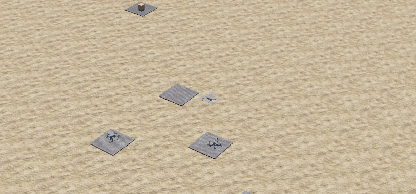
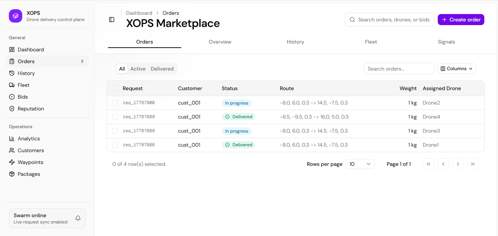

# XOPS: Decentralized Drone Delivery Marketplace

<p align="center">
   
</p>

A **Decentralized Drone Delivery Marketplace** built on the Tashi Vertex consensus engine for the Vertex Swarm Challenge 2026. This system enables trustless, peer-to-peer drone delivery coordination without central servers.

## 🚀 Quick Start

### Prerequisites

- **Webots** R2021a or newer
- **Rust** (install from https://rustup.rs)
- **CMake 4.0+** (`pip install cmake`)
- **Python 3.8+**
- **Bun.js 1+** and **bun** for the frontend
- **Windows (WSL)**: If on Windows, you can use WSL to build and run the Tashi binaries

### Installation

```bash
# 1. Clone and setup the base Tashi Vertex system
git clone https://github.com/fullendmaestro/xops
cd xops
./setup.sh
python utils/generate_config.py

# 3. Install frontend dependencies
cd web
bun install
bun run dev
```

### Running the System

1. **Start the Backend Swarm:**

   ```bash
   # Open Webots
   # Load worlds/xops-city.wbt
   # Press Play
   ```

2. **Start the Frontend:**

   ```bash
   cd web
   bun run dev
   ```

3. **Access the Marketplace:**
   - Open http://localhost:3000 in your browser
   - Submit delivery requests and track them in real-time

## 🏗️ Architecture

### Core Components

```
┌─────────────────┐    ┌─────────────────┐    ┌─────────────────┐
│   Next.js       │    │   Python        │    │   Rust          │
│   Frontend      │◄──►│   Controllers   │◄──►│   Consensus     │
│                 │    │   (XOPS Logic)  │    │   Layer         │
└─────────────────┘    └─────────────────┘    └─────────────────┘
```

### Key Features

1. **Delivery State Machine**: Manages drone lifecycle during deliveries
2. **Marketplace Manager**: Handles bid calculation and coordination
3. **Reputation System**: Tracks drone reliability and performance
4. **Configuration System**: Drone capabilities for marketplace operations

## 📁 Project Structure

```
xops/
├── controllers/
│   ├── tashi_drone/
│   │   ├── tashi_drone.py
│   │   ├── tashi_manager.py
│   │   ├── config.py
│   │   └── xops/
│   │       ├── delivery_state.py
│   │       ├── marketplace_manager.py
│   │       └── reputation_system.py
│   ├── tashi_server/
│   └── xops_supervisor/
├── tashi-tools/              # Rust consensus tools
├── web/                      # Next.js frontend
├── worlds/                   # Webots simulation worlds
├── utils/generate_config.py  # Swarm config generator
├── setup.sh
└── README.md
```

For a full tree, check the repository folders directly.

## 🎯 Key Features

### Marketplace Operations

- **Delivery Requests**: Customers submit delivery requests via web interface
- **Competitive Bidding**: Drones calculate and submit bids based on capabilities
- **Bid Awards**: Marketplace coordinates bid awards through consensus
- **Real-time Tracking**: Live delivery status updates across the swarm

### Decentralized Coordination

- **P2P Consensus**: All operations use Tashi Vertex for agreement
- **Zero-Trust Identity**: Ed25519 cryptographic keys for all participants
- **Reputation System**: Performance-based trust scoring without central authority

### Drone Capabilities

Each drone has configurable capabilities:

- **Payload Capacity**: Maximum cargo weight
- **Flight Range**: Maximum operational distance
- **Battery Capacity**: Power limitations
- **Base Location**: Home coordinates

## 🔧 Configuration

### Adding More Drones

1. Edit `utils/generate_config.py` and add names to `DRONE_NAMES`
2. Define drone capabilities in `DRONE_CAPABILITIES`
3. Run `python utils/generate_config.py`
4. Add matching drones in Webots with the same names

### Customizing Drone Capabilities

```python
# In utils/generate_config.py
DRONE_CAPABILITIES = {
    "Drone1": {
        "max_payload": 5.0,        # kg
        "max_range": 10000,        # meters
        "battery_capacity": 5000,  # mAh
        "base_location": {"x": 0, "y": 0, "z": 0},
        "reputation": 100.0
    }
}
```

## 🌐 Frontend Interface

The Next.js frontend provides:

- **Delivery Request Form**: Submit pickup/dropoff locations and package details
- **Real-time Dashboard**: Track active deliveries and drone status
- **Marketplace Statistics**: View swarm availability and performance metrics
- **Responsive Design**: Works on desktop and mobile devices

## 📸 Demo Preview

### Webots Swarm Simulation



### XOPS Marketplace Dashboard



## 🏆 Reputation System

The decentralized reputation system tracks:

- **Delivery Success Rate**: Percentage of completed deliveries
- **On-time Performance**: Adherence to ETA estimates
- **Customer Ratings**: Feedback-based scoring
- **Bid Accuracy**: Reliability of time and price estimates

Reputation affects:

- **Pricing Advantages**: High-reputation drones get better rates
- **Bid Priority**: Preference in competitive situations
- **Market Trust**: Customer confidence in service quality

## 📄 License

Apache 2.0 - See LICENSE file

---

Built with ❤️ for the [**Vertex Swarm Challenge 2026**](https://dorahacks.io/hackathon/global-vertex-swarm-challenge/detail) by [**Afolabi Abdulsamad**](https://github.com/fullendmaestro/)
